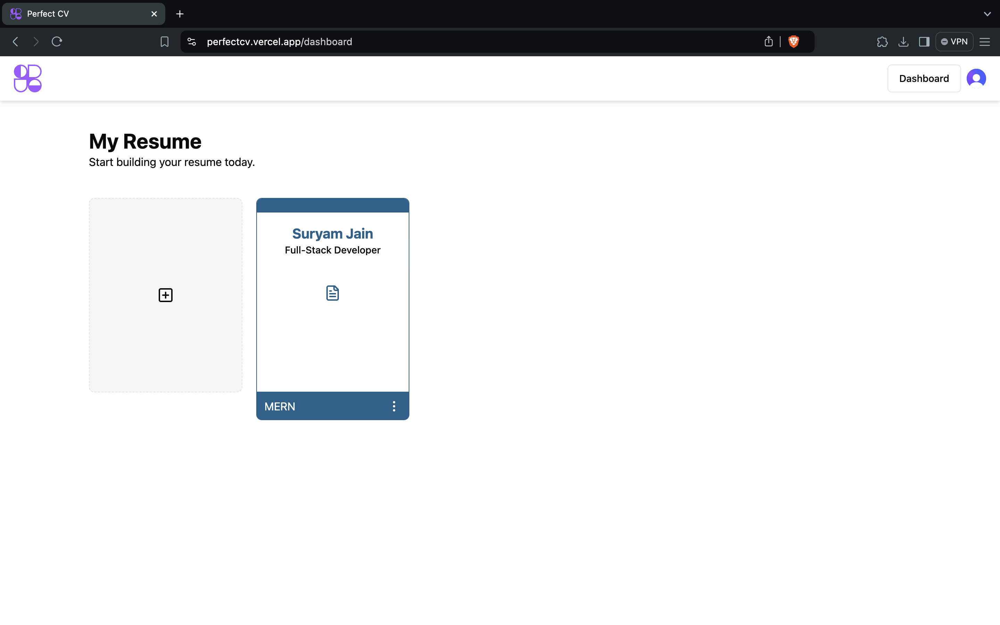
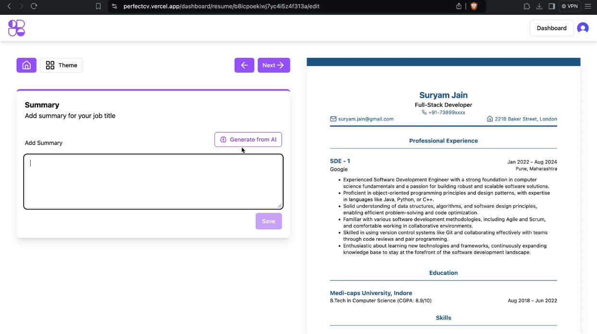
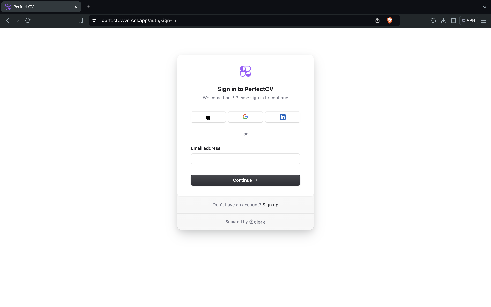
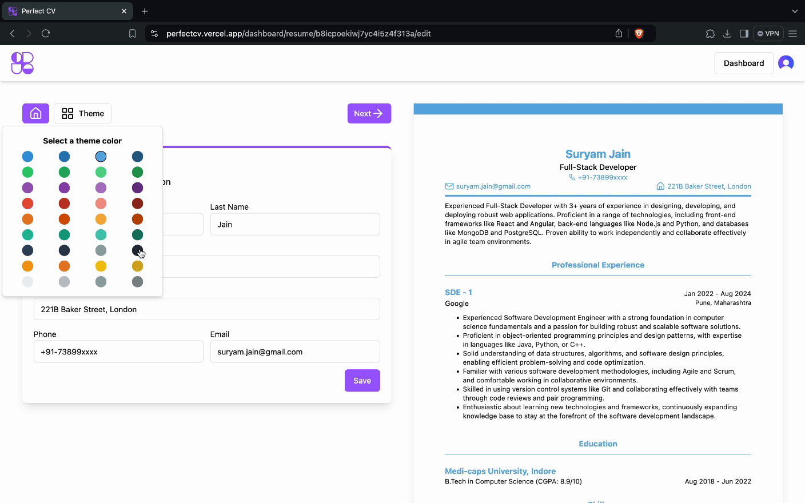
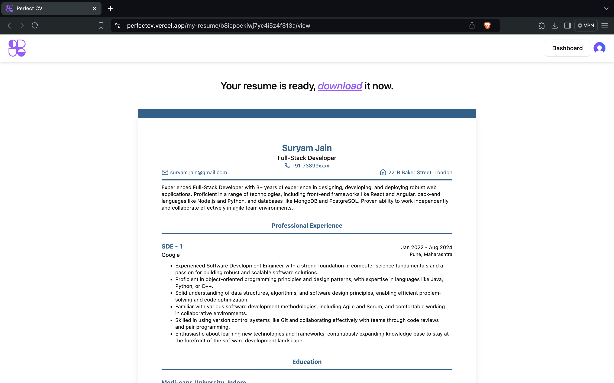
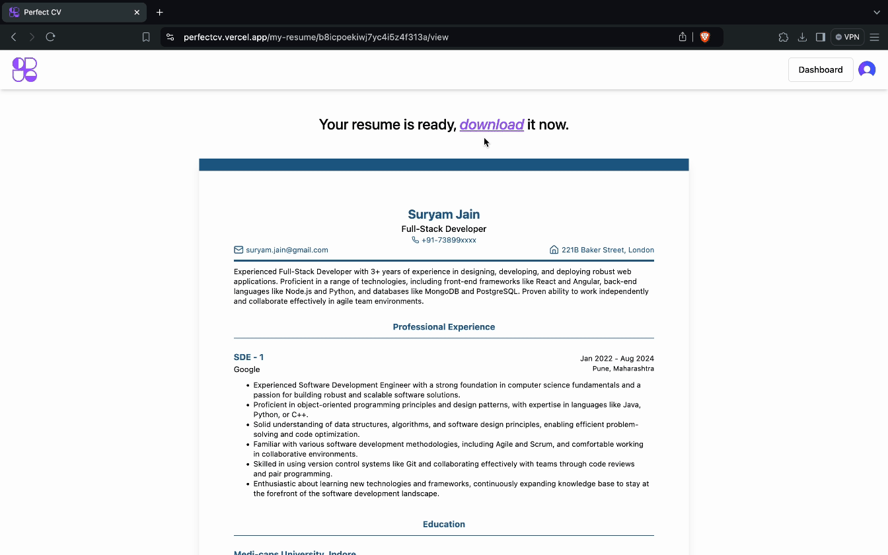

# PrefectCV - Resume Builder Application

## Table of Contents

- [Introduction](#introduction)
- [Features](#features)
- [Screenshots](#screenshots)
- [Technologies Used](#technologies-used)
- [Contributing](#contributing)
- [Contact](#contact)

## Introduction

Welcome to PrefectCV! This project is a Resume Builder application powered by Google Gemini, built using React, Clerk,
Strapi, and Tailwind CSS. The application features AI text generation, OAuth, color customization, and instant PDF
downloads.

## Features

- **AI Text Generation**: Generate professional resume content with AI.
- **OAuth**: Seamless authentication using Clerk.
- **Color Customization**: Personalize your resume with custom colors.
- **Instant PDF Downloads**: Download your resume instantly in PDF format.

## Screenshots

### AI Text Generation

### OAuth Authentication

### Color Customization

### Preview Resume

### Instant PDF Downloads

## Technologies Used

- **Frontend**: React, Tailwind CSS
- **Backend**: Strapi
- **Authentication**: Clerk
- **AI Integration**: Google Gemini

## Contributing

Contributions are welcome! Please follow these steps:

1. Fork the repository.
2. Create a new branch (`git checkout -b feature/YourFeature`).
3. Commit your changes (`git commit -m 'Add some feature'`).
4. Push to the branch (`git push origin feature/YourFeature`).
5. Open a Pull Request.

## Contact

For any inquiries, please contact [suryam.jain@gmail.com](mailto:suryam.jain@gmail.com).

---

**Happy Coding!**